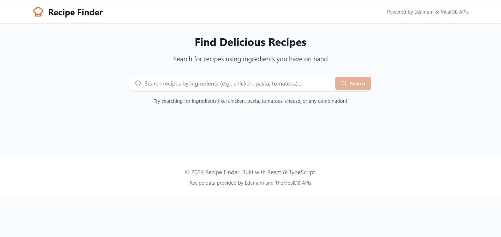
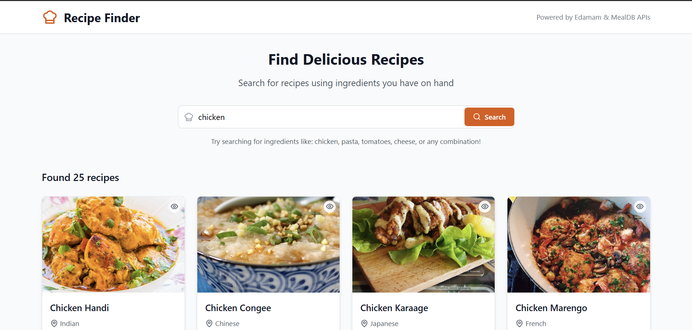
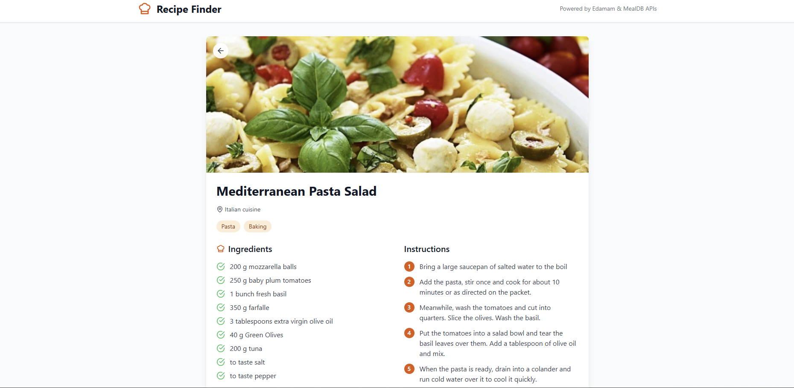

# Recipe Finder App

A modern web application that helps you discover delicious recipes using ingredients you have on hand. Built with React, TypeScript, and Tailwind CSS.

## 📸 Screenshots

### Homepage - Search Interface

*Clean and intuitive search interface with ingredient suggestions*

### Search Results

*Beautiful recipe cards displaying key information and ingredients*

### Recipe Details

*Detailed recipe view with ingredients, instructions, and cooking information*


## Features

- 🔍 **Ingredient-based Search**: Search for recipes using any combination of ingredients
- 📱 **Responsive Design**: Works perfectly on desktop, tablet, and mobile devices
- 🎨 **Modern UI**: Beautiful, intuitive interface with smooth animations
- 📋 **Detailed Recipe View**: View complete ingredients lists and cooking instructions
- 🔄 **Dual API Support**: Uses both Edamam and TheMealDB APIs for comprehensive recipe coverage
- ⚡ **Fast Performance**: Optimized for quick searches and smooth user experience

## Tech Stack

- **Frontend**: React 18 with TypeScript
- **Styling**: Tailwind CSS
- **Icons**: Lucide React
- **HTTP Client**: Axios
- **APIs**: Edamam Recipe API & TheMealDB API

## Getting Started

### Prerequisites

- Node.js (version 16 or higher)
- npm or yarn package manager

### Installation

1. **Clone the repository**
   ```bash
   git clone https://github.com/sanketInTech/Recipe-Finder-app.git
   cd Recipe-Finder-app
   ```

2. **Install dependencies**
   ```bash
   npm install
   ```

3. **Set up environment variables**
   
   Create a `.env` file in the root directory:
   ```env
   REACT_APP_EDAMAM_APP_ID=your_edamam_app_id
   REACT_APP_EDAMAM_APP_KEY=your_edamam_app_key
   REACT_APP_MEALDB_API_KEY=1
   ```

   **Note**: 
   - Get your Edamam API credentials from [Edamam Developer Portal](https://developer.edamam.com/edamam-recipe-api)
   - TheMealDB API is free and doesn't require registration

4. **Start the development server**
   ```bash
   npm start
   ```

5. **Open your browser**
   
   Navigate to [https://recipefinderapp1.netlify.app/](https://recipefinderapp1.netlify.app/) to see the app in action.

## API Setup

### Edamam API (Recommended)
1. Visit [Edamam Developer Portal](https://developer.edamam.com/edamam-recipe-api)
2. Sign up for a free account
3. Create a new application
4. Copy your App ID and App Key
5. Add them to your `.env` file

### TheMealDB API (Fallback)
- No registration required
- Uses the free tier (API key: 1)
- Provides detailed cooking instructions

## Usage

1. **Search for Recipes**: Enter ingredients in the search bar (e.g., "chicken pasta tomatoes")
2. **Browse Results**: View recipe cards with key information
3. **View Details**: Click on any recipe to see full ingredients and instructions
4. **Navigate Back**: Use the back button to return to search results

## Project Structure

```
src/
├── components/          # React components
│   ├── SearchBar.tsx   # Search input component
│   ├── RecipeCard.tsx  # Recipe preview card
│   └── RecipeDetail.tsx # Full recipe view
├── services/           # API services
│   └── api.ts         # API integration
├── types/             # TypeScript type definitions
│   └── index.ts       # Recipe and API types
├── App.tsx            # Main application component
├── index.tsx          # Application entry point
└── index.css          # Global styles
```

## Available Scripts

- `npm start` - Runs the app in development mode
- `npm build` - Builds the app for production
- `npm test` - Launches the test runner
- `npm eject` - Ejects from Create React App (not recommended)

## Contributing

1. Fork the repository
2. Create a feature branch (`git checkout -b feature/amazing-feature`)
3. Commit your changes (`git commit -m 'Add some amazing feature'`)
4. Push to the branch (`git push origin feature/amazing-feature`)
5. Open a Pull Request

## License

This project is licensed under the MIT License - see the LICENSE file for details.

## Acknowledgments

- [Edamam](https://www.edamam.com/) for providing the recipe API
- [TheMealDB](https://www.themealdb.com/) for additional recipe data
- [Tailwind CSS](https://tailwindcss.com/) for the beautiful styling framework
- [Lucide](https://lucide.dev/) for the amazing icons 
